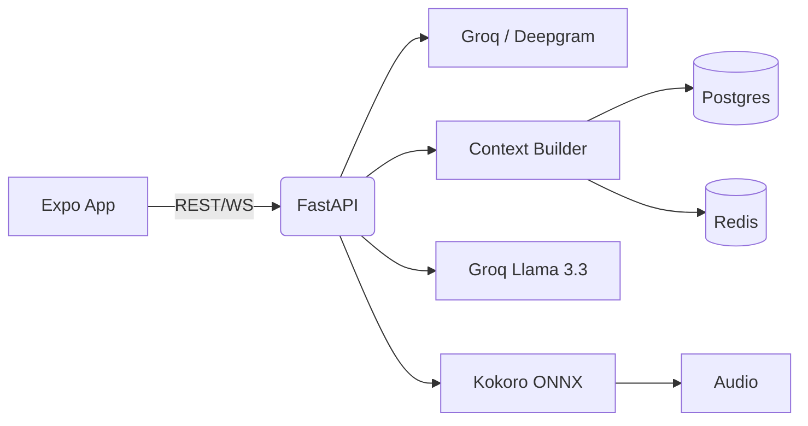

# JARVIS Voice Assistant

This project is wired around one Phase 1 backend-owned voice stack:

- `Deepgram Flux/Nova-3` for speech-to-text
- `Groq` for low-latency, low-cost chat generation
- `Deepgram Aura` for hosted text-to-speech
- `Kokoro ONNX` as a local development fallback only
- Expo mobile app as the microphone + playback client

Use this repo when you need a self-hosted voice assistant that can run without OpenAI or cloud TTS dependencies.

- Text ask -> text answer with no provider keys, using local fallback mode
- Voice ask -> AI answer when `DEEPGRAM_API_KEY` and `GROQ_API_KEY` are configured
- Spoken AI reply through Deepgram Aura, with Kokoro available for local fallback



## Feature Modes
| Mode | Requirements | Behavior |
| --- | --- | --- |
| Text-only fallback | No external keys | Sends chat prompts via REST and renders text responses |
| Full voice loop | `GROQ_API_KEY`, Kokoro assets, microphone permissions | Record, transcribe, generate LLM answer, synthesize speech, playback |
| Offline TTS | Kokoro files available locally | Backend continues to speak replies even if external TTS is unavailable |

## Supported Environments
- iOS Simulator (Apple Silicon) and Android Emulator (API 33+)
- Physical devices via Expo Dev Client (requires `expo run:<platform>`)
- Backend on macOS/Linux with Python 3.11+; Docker Compose for consolidated infra

GROQ_API_KEY=your_groq_key
GROQ_CHAT_MODEL=openai/gpt-oss-120b
GROQ_FALLBACK_MODEL=llama-3.1-8b-instant
DEEPGRAM_API_KEY=your_deepgram_key
DEEPGRAM_STT_MODEL=nova-3
DEEPGRAM_TTS_MODEL=aura-2-thalia-en

# Local development fallback only
KOKORO_MODEL_PATH=/absolute/path/to/backend/models/kokoro/kokoro-v1.0.int8.onnx
KOKORO_VOICES_PATH=/absolute/path/to/backend/models/kokoro/voices-v1.0.bin
KOKORO_DEFAULT_VOICE=af_sarah
KOKORO_DEFAULT_LANGUAGE=en-us
KOKORO_DEFAULT_SPEED=1.0

PINECONE_API_KEY=
OPENAI_API_KEY= # embeddings only unless explicitly reconfigured
```

Notes:

- Postgres is the durable Knowledge Base. Redis is cache/working memory.
- `OPENAI_API_KEY` is not required for the active LLM path; it is used for embeddings.
- Kokoro runs locally and does not require external TTS auth, but it is not the production default.

## Run

Backend:

## Running Locally
### Backend
```bash
cd backend
python -m venv .venv && source .venv/bin/activate
pip install -r requirements.txt
uvicorn app.main:app --reload --port 8000
```

### Mobile App
```bash
npm install
npm start # choose platform from Expo CLI
```
- `npx expo run:android` / `npx expo run:ios` builds Dev Client when you need native modules.
- Ensure the device can reach the backend URL in `.env` (use `http://10.0.2.2` for Android emulator).

### Docker Compose
The root `docker-compose.yml` launches backend + Postgres + Redis. Set the same env vars or mount `backend/.env`.

1. Open the app.
2. Type into the composer to verify backend ask/answer works.
3. Hold the orb to record.
4. Release to send audio to the backend.
5. Backend transcribes with Deepgram, builds server-side context, generates the response with Groq, synthesizes with Deepgram Aura, and returns audio for playback.
6. After the conversation completes, a Celery task extracts durable facts into PostgreSQL and logs `knowledge_updates`.

## Troubleshooting
- **Text works, voice silent** — verify `GROQ_API_KEY` and Kokoro paths; backend logs should show `context_built` and `tts_generated` events.
- **Android cannot reach backend** — keep `EXPO_PUBLIC_API_URL=http://10.0.2.2:8000` and ensure emulator and FastAPI share the same host machine.
- **No speech output** — confirm `backend/models/kokoro` files are readable by the backend process.
- **WebSocket auth** — implement the token handshake described in `plans/project-improvements.md` before exposing the endpoint publicly.

- If text works but voice does not transcribe, check `DEEPGRAM_API_KEY`.
- If text works and voice transcribes but no spoken reply plays, check Deepgram TTS settings first, then Kokoro fallback paths.
- Android emulator should usually use `http://10.0.2.2:8000` for `EXPO_PUBLIC_API_URL`.
- iOS simulator can usually use `http://127.0.0.1:8000`.
