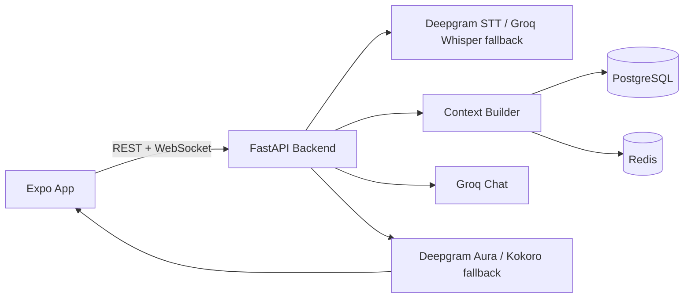

# JARVIS Voice Assistant

JARVIS is an Expo mobile app backed by a FastAPI assistant service. It demonstrates a full voice loop: record on device, stream audio to the backend, transcribe speech, build server-side memory/context, generate an answer, synthesize speech, and play the response in the app.

The project is portfolio-ready as a self-hosted AI assistant prototype. It can run in local fallback mode without provider keys for text testing, and it supports the full voice experience when provider credentials are configured.

## Demo

Watch the demo: [JARVIS Voice Assistant Demo](https://youtube.com/shorts/8DVzpbzEVlk)

## What It Does

- Text ask -> assistant answer through the backend-owned `/api/v1/ai/process` pipeline.
- Voice ask -> speech transcription, context building, LLM response streaming, and spoken playback over WebSocket.
- Persistent conversation and knowledge storage using PostgreSQL, with Redis for working memory/cache.
- Local development fallback responses when model provider keys are missing.
- Deepgram Aura TTS by default, with Kokoro ONNX available as a local fallback.


```mermaid
graph LR
    App[Expo App] -->|REST + WebSocket| API[FastAPI Backend]
    API --> STT[Deepgram STT / Groq Whisper fallback]
    API --> Context[Context Builder]
    Context --> Postgres[(PostgreSQL)]
    Context --> Redis[(Redis)]
    API --> LLM[Groq Chat]
    API --> TTS[Deepgram Aura / Kokoro fallback]
    TTS --> App
```

## Feature Modes

| Mode | Requirements | Behavior |
| --- | --- | --- |
| Text fallback | Backend running, no provider keys | Sends text prompts through REST and returns local-mode answers |
| Full text assistant | `GROQ_API_KEY` | Uses Groq for generated assistant responses |
| Full voice loop | `DEEPGRAM_API_KEY`, `GROQ_API_KEY`, microphone permission | Records speech, transcribes, answers, synthesizes speech, and plays audio |
| Local TTS fallback | Kokoro model files available | Synthesizes speech locally if Deepgram TTS is unavailable or disabled |

## Local Setup

### 1. Configure Environment

Mobile app:

```bash
cp .env.example .env
```

For Android emulator, keep:

```bash
EXPO_PUBLIC_API_URL=http://10.0.2.2:8000
```

For iOS simulator or local web, use:

```bash
EXPO_PUBLIC_API_URL=http://127.0.0.1:8000
```

Backend:

```bash
cp backend/.env.example backend/.env
```

Important backend values:

```bash
GROQ_API_KEY=your_groq_key
GROQ_CHAT_MODEL=openai/gpt-oss-120b
GROQ_FALLBACK_MODEL=llama-3.1-8b-instant
GROQ_STT_MODEL=whisper-large-v3-turbo

DEEPGRAM_API_KEY=your_deepgram_key
DEEPGRAM_STT_MODEL=nova-3
DEEPGRAM_TTS_MODEL=aura-2-thalia-en

# Optional local TTS fallback
KOKORO_MODEL_PATH=/absolute/path/to/backend/models/kokoro/kokoro-v1.0.int8.onnx
KOKORO_VOICES_PATH=/absolute/path/to/backend/models/kokoro/voices-v1.0.bin
KOKORO_DEFAULT_VOICE=af_sarah
KOKORO_DEFAULT_LANGUAGE=en-us
KOKORO_DEFAULT_SPEED=1.0

# Embeddings/knowledge features
OPENAI_API_KEY=
PINECONE_API_KEY=
```

Provider secrets belong in `backend/.env`; the mobile app should only know the backend base URL.

### 2. Run the Backend

```bash
npm run backend:setup
npm run backend
```

The backend listens on `0.0.0.0:8000`, which lets physical phones on the same LAN reach it. Verify from the simulator, browser, or phone:

```text
http://<backend-host>:8000/health
```

Expected response:

```json
{"status":"healthy","version":"1.0.0","debug":true}
```

### 3. Run the Mobile App

```bash
npm install
npm start
```

Useful variants:

```bash
npm run start:go -- --clear
npm run start:dev-client -- --clear
npm run android
npm run ios
```

Use a Dev Client build when native modules are required.

### 4. Optional Docker Services

The root `docker-compose.yml` runs backend support services such as PostgreSQL and Redis:

```bash
docker-compose up -d
```

Use the same backend environment variables as local development.

## Validation

Frontend checks:

```bash
npm run type-check
npm test
```

Backend checks:

```bash
cd backend
pytest
```

WebSocket voice protocol smoke test:

```bash
BACKEND_WS=ws://localhost:8000/api/v1/ws/voice/1 node scripts/ws_test_node.js
```

See `scripts/WSTEST.md` for details.

## Troubleshooting

| Symptom | Fix |
| --- | --- |
| Phone cannot connect to backend | Run `npm run backend`, confirm `/health` from the phone browser, and set `EXPO_PUBLIC_API_URL` to the Mac LAN IP |
| Android emulator cannot reach backend | Use `EXPO_PUBLIC_API_URL=http://10.0.2.2:8000` |
| iOS simulator cannot reach backend | Use `EXPO_PUBLIC_API_URL=http://127.0.0.1:8000` |
| WebSocket closes immediately | In local unauthenticated testing, set `ALLOW_INSECURE_DEV_AUTH=true` in `backend/.env` |
| Text works but voice does not transcribe | Check `DEEPGRAM_API_KEY`, `GROQ_API_KEY`, microphone permission, and backend logs |
| Voice transcribes but no audio plays | Check Deepgram TTS first, then Kokoro fallback paths if using local TTS |
| No memory/context appears in answers | Confirm PostgreSQL and Redis are running and inspect backend logs for context builder or fact extraction errors |

## Production Notes

- Do not expose `/api/v1/ws/voice/{user_id}` without JWT/session authentication.
- Keep provider keys only on the backend.
- Replace the default `SECRET_KEY` before production.
- Use PostgreSQL backups and Redis persistence for durable assistant memory.
- See `backend/DEPLOYMENT_NOTES.md` for deployment and operations guidance.
