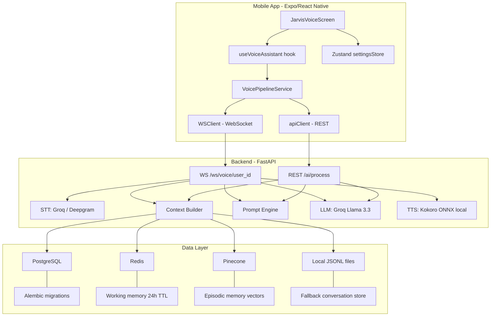

# JARVIS Project — Improvement Plan

## Executive Summary

After reviewing the full codebase — frontend (Expo/React Native), backend (FastAPI), services, infrastructure, and tests — the project is functionally complete for an MVP. The voice pipeline (STT → Context → LLM → TTS) works end-to-end, the knowledge base scaffolding is in place, and graceful fallbacks exist for every external dependency. Below are concrete improvements grouped by priority.

---

## Architecture Overview (current state)

---

## 1. Critical — Security

### 1.1 WebSocket has no authentication
[`websocket_voice()`](backend/app/api/voice.py:411) accepts any `user_id` with zero auth checks. Anyone who knows the URL can impersonate any user.

**Fix:** Add a token query-param or first-message auth handshake. Example: `ws://host/ws/voice/{user_id}?token=<JWT>` — validate the JWT before accepting the socket.

### 1.2 API keys stored in AsyncStorage
[`settingsStore.ts`](src/store/settingsStore.ts:130) explicitly notes API keys should be in `SecureStore`, but [`partialize`](src/store/settingsStore.ts:123) still persists them to `AsyncStorage`. Any rooted device can read them.

**Fix:** Move `openAiApiKey` / `groqApiKey` fields to `expo-secure-store` with a separate getter/setter; remove them from the persisted Zustand slice entirely.

### 1.3 `google-services.json` is committed to git
[`google-services.json`](google-services.json) contains Firebase project metadata. It should be listed in [`.gitignore`](.gitignore) and provided via CI secrets.

### 1.4 Hardcoded dev secret key
[`config.py`](backend/app/core/config.py:42) defaults `secret_key` to `"development-secret-key-change-in-production"`. Add a validator that raises when `app_env == "production"` and the default key is still set.

### 1.5 No rate limiting
No rate-limit middleware on REST or WS endpoints. Add `slowapi` or a simple token-bucket middleware at the FastAPI level to prevent abuse.

---

## 2. High — Bugs & Runtime Errors

### 2.1 `pinecone_client` used but not imported in `main.py`
[`api_status()`](backend/app/main.py:127) references `pinecone_client` which is never imported — this endpoint **will crash** at runtime.

**Fix:** Add `from app.db.pinecone_client import pinecone_client` at the top of `main.py`.

### 2.2 Async-constructor anti-pattern in voice pipeline
[`sendRecordingToBackend()`](src/services/voicePipeline.ts:335) uses `new Promise(async (resolve, reject) => { ... })` — this is a known anti-pattern where thrown errors inside the async executor bypass the Promise rejection chain.

**Fix:** Refactor to a plain `async function` and return its result directly.

### 2.3 `datetime.utcnow()` is deprecated
Used across the backend (models, conversation_memory, auth). Since Python 3.12 this triggers deprecation warnings and will be removed.

**Fix:** Replace with `datetime.now(datetime.UTC)` or `datetime.now(timezone.utc)` everywhere.

### 2.4 Naming inconsistency: Medicus vs JARVIS
- [`app.json`](app.json:3) says `"name": "Medicus"`, slug `medicus`
- [`OnboardingScreen.tsx`](src/screens/OnboardingScreen.tsx:20) says "AI Health Assistant" / "Medicus"
- README, prompts, and UI all say "JARVIS"

**Fix:** Pick one identity and unify everywhere. OG config, splash, onboarding copy, and system prompts should all agree.

---

## 3. High — Code Quality

### 3.1 `voice.py` is a 520-line monolith
[`backend/app/api/voice.py`](backend/app/api/voice.py) mixes WebSocket routing, STT calls, LLM streaming, TTS synthesis, local fallback logic, and REST endpoints all in one file.

**Fix:** Extract into:
- `backend/app/services/stt_service.py` — Groq + Deepgram STT
- `backend/app/services/llm_service.py` — chat completion (streaming + non-streaming)
- Keep `voice.py` as thin router that orchestrates these services

### 3.2 `JarvisVoiceScreen.tsx` is 684 lines
[`JarvisVoiceScreen.tsx`](src/components/JarvisVoiceScreen.tsx) handles UI, backend polling, wake word, voice selection, user bootstrapping, and text input.

**Fix:** Extract into:
- `useBackendHealth.ts` — backend status + voice list polling
- `useUserBootstrap.ts` — user ID creation + backend sync
- `ConversationPanel.tsx` — the output section with messages + composer
- Keep `JarvisVoiceScreen.tsx` as the layout shell

### 3.3 Multiple ESLint configs
Three ESLint config files exist (`.eslintrc.cjs`, `.eslintrc.js`, `eslint.config.cjs`). Only one should be active.

**Fix:** Consolidate into a single `eslint.config.cjs` (flat config if ESLint 9+) and delete the others.

### 3.4 `wsClient.ts` has no TypeScript safety
[`WSClient`](src/services/wsClient.ts:7) uses `any` for all message handlers and payloads.

**Fix:** Define a discriminated union type for all WS message types (matching the backend's `type` field values) and use it for both sending and receiving.

### 3.5 `shared/types.ts` has stale types
[`shared/types.ts`](shared/types.ts) still defines `BiometricData`, `Intervention`, `LifeState`, etc. that have been "removed in pivot" per code comments. Dead types add confusion.

**Fix:** Remove types that no longer map to real data flows, or mark them explicitly as `@deprecated` with a plan.

### 3.6 Knowledge tables are copy-pasted
[`models.py`](backend/app/db/models.py:139) has 6 nearly identical Knowledge* models (Identity, Goals, Projects, Finances, Relationships, Patterns). Each has exact same columns.

**Fix:** Consider a single `KnowledgeFact` table with a `domain` enum column. This simplifies queries, migrations, and the context builder.

---

## 4. Medium — Testing

### 4.1 Minimal backend test coverage
Only 5 test files exist covering basic unit tests. Missing:
- WebSocket voice endpoint integration test
- Auth token flow test
- Context builder test with mocked DB/Redis
- Knowledge API tests
- Push service tests

**Fix:** Add pytest fixtures for async DB sessions (use SQLite in-memory), mock Redis, and write integration tests for each API router.

### 4.2 No frontend component tests
Only 3 front-end test files with basic mocks. Missing:
- `JarvisVoiceScreen` render + interaction test
- `useVoiceAssistant` hook test with mocked pipeline
- `settingsStore` state management tests

**Fix:** Use `@testing-library/react-native` to test component rendering and interaction flows.

### 4.3 No end-to-end test harness
The `scripts/` directory has manual WS test scripts but no automated E2E test.

**Fix:** Add a Playwright or Detox E2E test that starts the backend in test-mode and exercises the voice flow programmatically.

---

## 5. Medium — Performance & DX

### 5.1 Large binary files in git
- [`test.mp3`](test.mp3) — 8.5 MB
- `backend/models/kokoro/kokoro-v1.0.int8.onnx` — 91.7 MB
- `backend/models/kokoro/voices-v1.0.bin` — 26.8 MB

These bloat the repo and slow clones.

**Fix:** Add these to `.gitignore` and use Git LFS or a download script. Document the model download step in README.

### 5.2 No CI/CD pipeline
No `.github/workflows/` or equivalent CI config. Tests, linting, and type-checking are manual.

**Fix:** Add a GitHub Actions workflow that runs:
1. `npm run type-check` + `npm run lint`
2. `npm test`
3. `cd backend && pytest`
4. Docker build validation

### 5.3 Backend Dockerfile is minimal
[`Dockerfile`](backend/Dockerfile) runs as root, has no multi-stage build, no `.dockerignore`, and includes test/dev files in the image.

**Fix:**
- Add a `.dockerignore` (exclude tests, scripts, .env, __pycache__)
- Use multi-stage build (builder + runtime)
- Run as non-root user
- Pin Python version more precisely

### 5.4 No structured logging
Backend uses `logging.getLogger(__name__)` but no formatter/handler configuration. Logs are unstructured plain text.

**Fix:** Configure `structlog` or `python-json-logger` for JSON-structured logs, especially useful when running in Docker/production.

### 5.5 WebSocket creates new connection per recording
[`sendRecordingToBackend()`](src/services/voicePipeline.ts:320) creates a new `WSClient()` for each voice interaction — full TCP+WS handshake every time.

**Fix:** Maintain a persistent WSClient connection per session, with reconnect logic. Reuse across multiple voice interactions.

---

## 6. Low — Polish & Hardening

### 6.1 Hardcoded user ID for push registration
[`App.tsx`](App.tsx:66) has `registerForPushNotificationsAsync(1)` with a TODO comment.

**Fix:** Use the actual `userId` from the settings store.

### 6.2 No request ID / correlation tracking
No middleware generates a request ID, so tracing a request across logs is difficult.

**Fix:** Add a middleware that injects `X-Request-ID` header and passes it through logging context.

### 6.3 Context builder timeouts are hardcoded
[`build_context()`](backend/app/core/context_builder.py:232) uses hardcoded timeouts (1.0s, 0.8s, 0.5s).

**Fix:** Move these to `Settings` so they can be tuned per environment.

### 6.4 `apiClient.ts` top-level function before imports
[`logTrigger()`](src/services/apiClient.ts:8) is defined before the import statements. While JS hoisting makes this work, it hurts readability.

**Fix:** Move imports to top, then exports.

### 6.5 Location + Calendar services exist but are not wired to backend context
[`locationService.ts`](src/services/locationService.ts) and [`calendarService.ts`](src/services/calendarService.ts) exist on the frontend but their data never reaches `build_context()`.

**Fix:** Either wire them into the WebSocket message payload as `client_context` so the backend can include them, or remove the dead services.

### 6.6 Error auto-dismiss timeout is hardcoded
[`useVoiceAssistant.ts`](src/hooks/useVoiceAssistant.ts:133) has `setTimeout(() => setError(null), 5000)` which silently clears errors.

**Fix:** Make the timeout configurable or let the UI manage error dismissal explicitly.

### 6.7 `RedisClient._pool is None` checks scattered everywhere
The Redis singleton's uninitialized state is checked ad-hoc in [`conversation_memory.py`](backend/app/services/conversation_memory.py:119), [`context_builder.py`](backend/app/core/context_builder.py:59), etc.

**Fix:** Add a `redis_client.is_connected` property and use it consistently. Better yet, initialize Redis in the FastAPI lifespan event and use dependency injection.

---

## Suggested Priority Order

| Priority | Category | Items |
|----------|----------|-------|
| **P0** | Security | 1.1 WS auth, 1.2 SecureStore keys, 1.3 google-services.json, 1.4 prod secret validation |
| **P1** | Bugs | 2.1 missing import crash, 2.2 async anti-pattern, 2.3 deprecated datetime, 2.4 naming |
| **P2** | Architecture | 3.1 split voice.py, 3.2 split JarvisVoiceScreen, 3.3 ESLint cleanup, 3.4 WS types |
| **P3** | Testing | 4.1 backend integration tests, 4.2 frontend tests, 4.3 E2E harness |
| **P4** | DX / Perf | 5.1 Git LFS, 5.2 CI/CD, 5.3 Dockerfile, 5.4 structured logs, 5.5 persistent WS |
| **P5** | Polish | 6.1–6.7 various hardening items |
